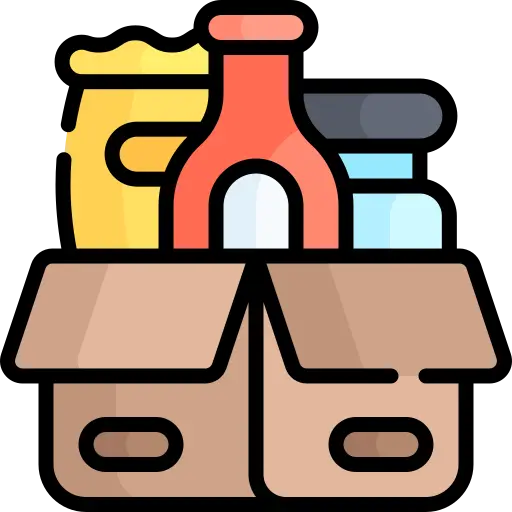

<h1> Pantry to Plate</h1>

    
    
    

## Pantry to Plate is an AI assisted recipe generator.
This application is built with React+Vite and styled with Tailwind. It utilizes the huggingface API to generate a recipe based upon the list of ingredients provided by the user.

### Take Aways
I learned so much while creating this project; Everything from managing state and passings props in React to creating a netlify function to proxy my API key. I have many exciting ideas for features that I can see myself returning to this project many times in the future, both as a developer and an user!
